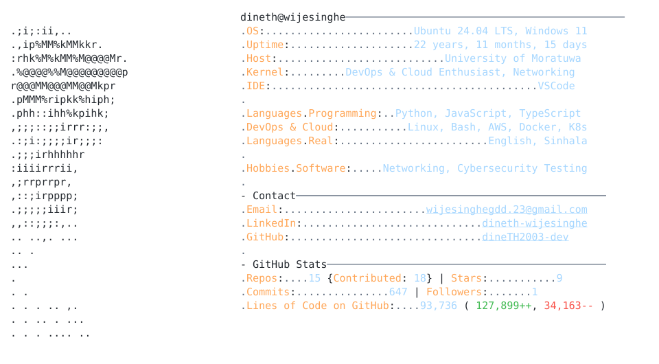

  <!-- Typing Header -->
  

    

  <!-- Neofetch Dynamic Card (Dark / Light Theme Auto-Toggle) -->
  <a href="https://github.com/dineTH2003-dev">
    <picture>
      <source media="(prefers-color-scheme: dark)" srcset="dark_mode.svg">
      
    </picture>
  </a>

 

## 🛠️ Tech Stack & Architecture

<table>
  <tr>
    <td valign="top" width="50%">
      <h3>💻 Languages & Frontend</h3>
      
      
      
      
      
      
      
      
    </td>
    <td valign="top" width="50%">
      <h3>⚡ Backend & Databases</h3>
      
      
      
      
      
      
    </td>
  </tr>
  <tr>
    <td valign="top" width="50%">
      <h3>☁️ Cloud & DevOps</h3>
      
      
      
      
      
      
    </td>
    <td valign="top" width="50%">
      <h3>📊 Observability & SRE Tools</h3>
      
      
      
      
      
    </td>
  </tr>
</table>

 

## 🌐 Connect With Me

  
  

